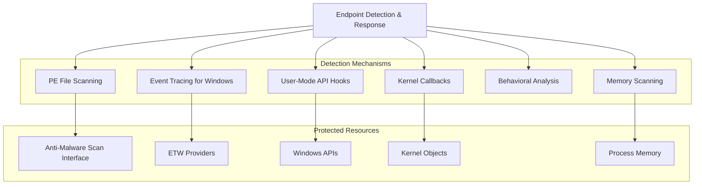
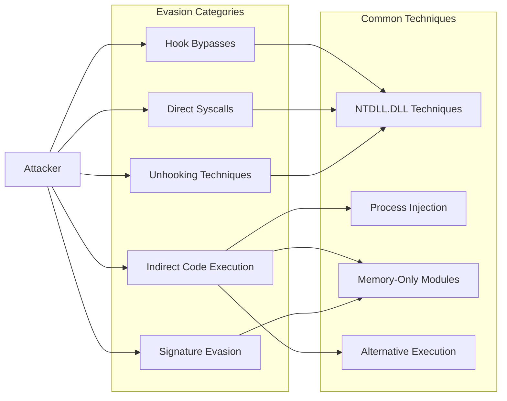
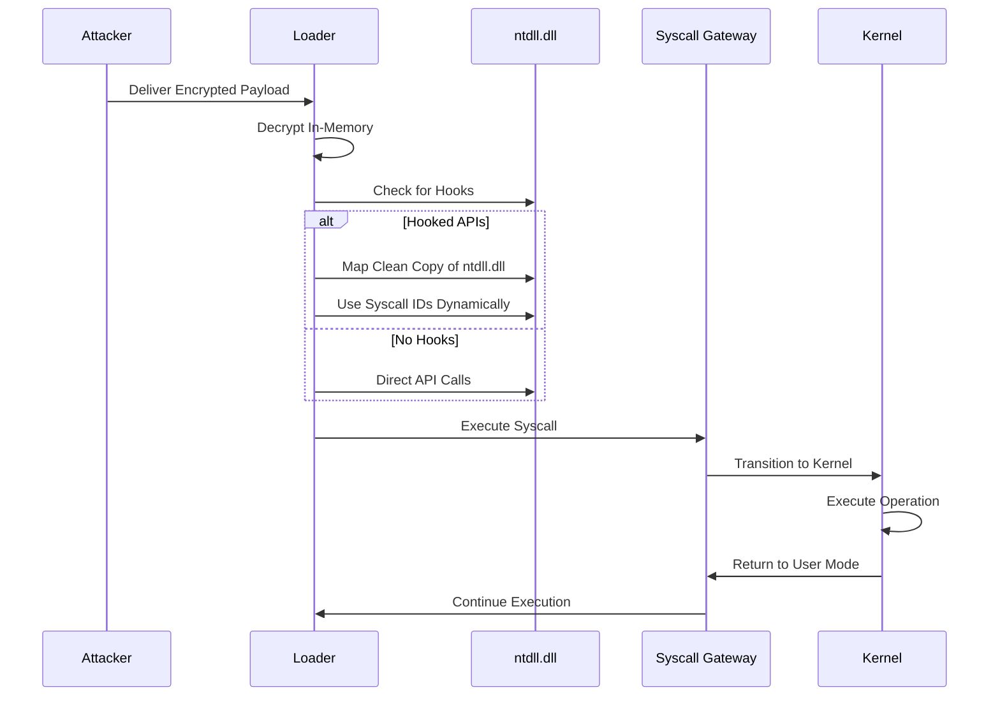

## Diagrams

### EDR Detection & Prevention Mechanisms

```mermaid
flowchart TB
    EDR["Endpoint Detection & Response"]

    subgraph "Detection Mechanisms"
        UserHooks["User-Mode API Hooks"]
        KernelHooks["Kernel Callbacks"]
        ETW["Event Tracing for Windows"]
        PE["PE File Scanning"]
        Behavior["Behavioral Analysis"]
        Memory["Memory Scanning"]
    end

    subgraph "Protected Resources"
        AMSI["Anti-Malware Scan Interface"]
        ETW2["ETW Providers"]
        WinAPI["Windows APIs"]
        KernelObj["Kernel Objects"]
        ProcMem["Process Memory"]
    end

    EDR --> UserHooks
    EDR --> KernelHooks
    EDR --> ETW
    EDR --> PE
    EDR --> Behavior
    EDR --> Memory

    UserHooks --> WinAPI
    KernelHooks --> KernelObj
    ETW --> ETW2
    PE --> AMSI
    Memory --> ProcMem
```

### EDR Evasion Techniques

```mermaid
flowchart LR
    Attacker["Attacker"]

    subgraph "Evasion Categories"
        HookBypass["Hook Bypasses"]
        DirectSyscalls["Direct Syscalls"]
        IndirectJumps["Indirect Code Execution"]
        UnhookingTech["Unhooking Techniques"]
        SignatureEvade["Signature Evasion"]
    end

    subgraph "Common Techniques"
        NTDLL["NTDLL.DLL Techniques"]
        ProcInject["Process Injection"]
        MemModules["Memory-Only Modules"]
        AltExecution["Alternative Execution"]
    end

    Attacker --> HookBypass
    Attacker --> DirectSyscalls
    Attacker --> IndirectJumps
    Attacker --> UnhookingTech
    Attacker --> SignatureEvade

    HookBypass --> NTDLL
    DirectSyscalls --> NTDLL
    IndirectJumps --> ProcInject
    IndirectJumps --> MemModules
    IndirectJumps --> AltExecution
    UnhookingTech --> NTDLL
    SignatureEvade --> MemModules
```

### Modern EDR Evasion Workflow

```mermaid
sequenceDiagram
    participant A as Attacker
    participant L as Loader
    participant N as ntdll.dll
    participant S as Syscall Gateway
    participant K as Kernel

    A->>L: Deliver Encrypted Payload
    L->>L: Decrypt In-Memory
    L->>N: Check for Hooks

    alt Hooked APIs
        L->>N: Map Clean Copy of ntdll.dll
        L->>N: Use Syscall IDs Dynamically
    else No Hooks
        L->>N: Direct API Calls
    end

    L->>S: Execute Syscall
    S->>K: Transition to Kernel
    K->>K: Execute Operation
    K->>S: Return to User Mode
    S->>L: Continue Execution
```

