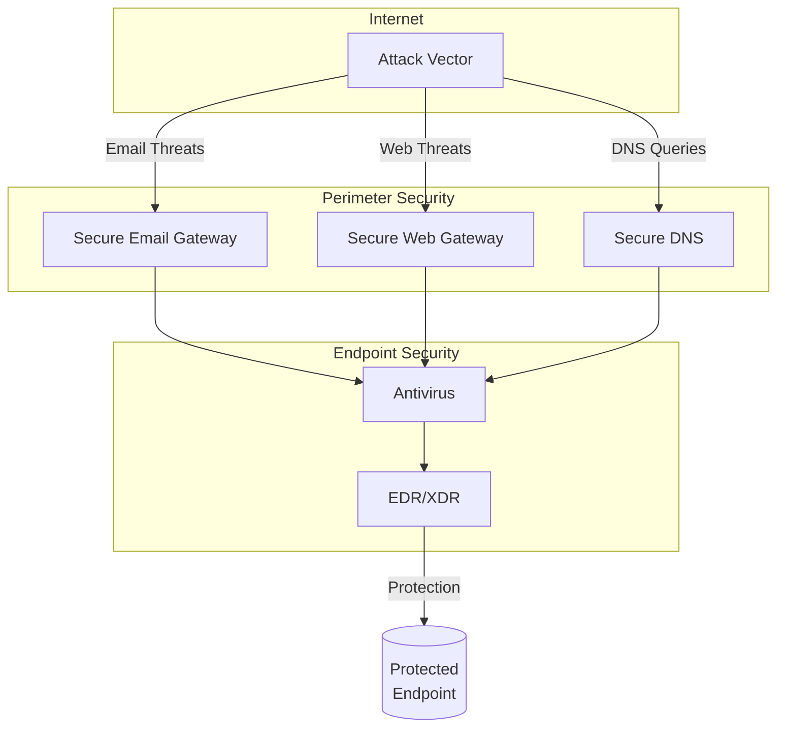
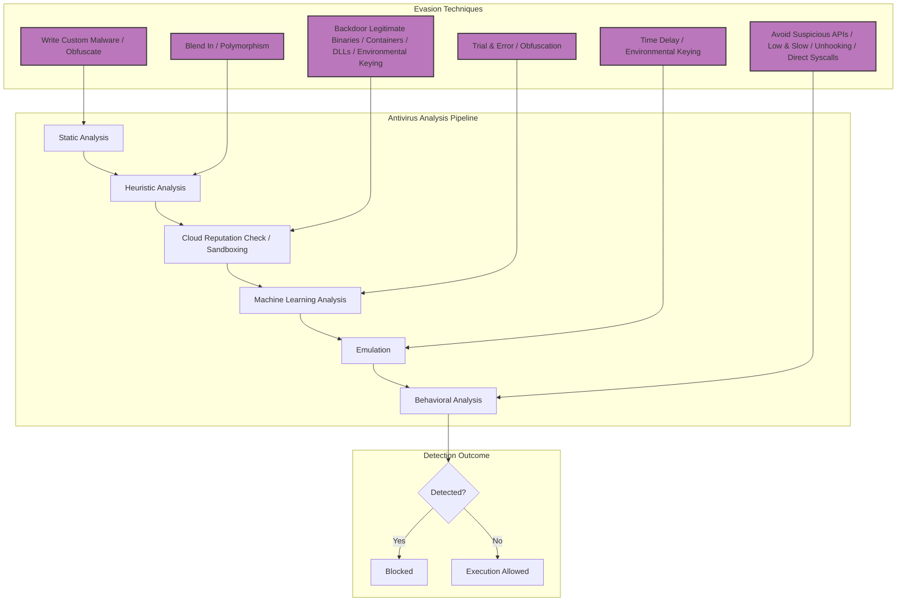

## Diagrams

```mermaid
flowchart TB
    subgraph "Internet"
        Attack["Attack Vector"]
    end

    subgraph "Perimeter Security"
        SEG["Secure Email Gateway"]
        SWG["Secure Web Gateway"]
        DNS["Secure DNS"]
    end

    subgraph "Endpoint Security"
        AV["Antivirus"]
        EDR["EDR/XDR"]
    end

    Attack -->|Email Threats| SEG
    Attack -->|Web Threats| SWG
    Attack -->|DNS Queries| DNS

    SEG --> AV
    SWG --> AV
    DNS --> AV

    AV --> EDR

    EDR -->|Protection| Endpoint[("Protected\nEndpoint")]
```

#### Antivirus

```mermaid
flowchart TD
    subgraph "Antivirus Analysis Pipeline"
        direction LR
        A[Static Analysis] --> B[Heuristic Analysis];
        B --> C[Cloud Reputation Check / Sandboxing];
        C --> D[Machine Learning Analysis];
        D --> E[Emulation];
        E --> F[Behavioral Analysis];
    end

    subgraph "Evasion Techniques"
        direction TB
        EvadeStatic[Write Custom Malware / Obfuscate] --> A;
        EvadeHeuristic[Blend In / Polymorphism] --> B;
        EvadeCloud[Backdoor Legitimate Binaries / Containers / DLLs / Environmental Keying] --> C;
        EvadeML[Trial & Error / Obfuscation] --> D;
        EvadeEmulation[Time Delay / Environmental Keying] --> E;
        EvadeBehavioral[Avoid Suspicious APIs / Low & Slow / Unhooking / Direct Syscalls] --> F;
    end

    subgraph "Detection Outcome"
        F --> G{Detected?};
        G -- Yes --> H[Blocked];
        G -- No --> I[Execution Allowed];
    end

    classDef evasion fill:#b7b,stroke:#333,stroke-width:2px,color:#333;
    class EvadeStatic,EvadeHeuristic,EvadeCloud,EvadeML,EvadeEmulation,EvadeBehavioral evasion;
```

