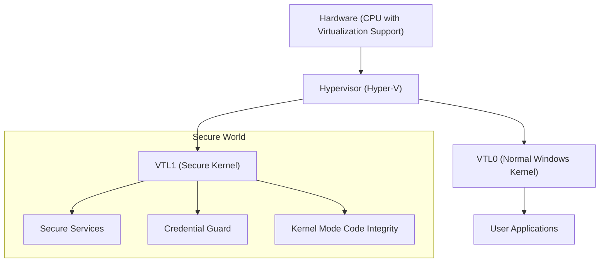
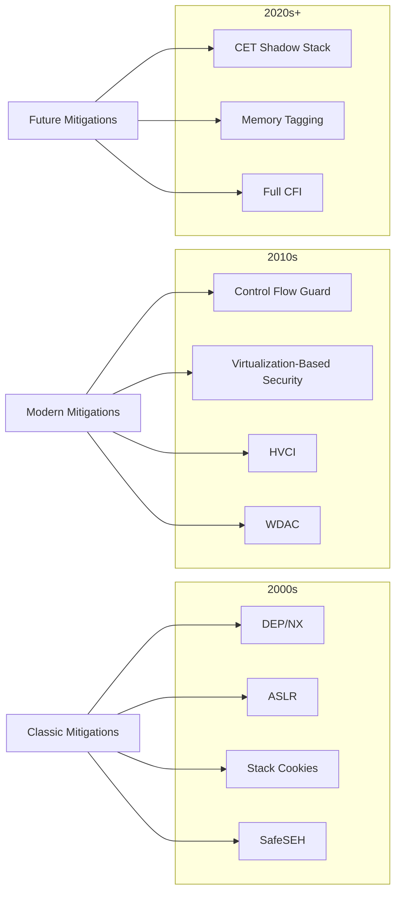

## Diagrams

### Modern Security Architecture

```mermaid
flowchart TB
    System["System Security"]

    subgraph "Memory Protection"
        KASLR["Kernel ASLR"]
        KPTI["Kernel Page Table Isolation"]
        SMAP["Supervisor Mode Access Prevention"]
        SMEP["Supervisor Mode Execution Prevention"]
        KDP["Kernel Data Protection"]
        RODATA["Read-Only Data Sections"]
    end

    subgraph "Virtualization Security"
        VBS["Virtualization-Based Security"]
        HVCI["Hypervisor-Enforced Code Integrity"]
        MBEC["Mode-Based Execution Control"]
        KMCI["Kernel Mode Code Integrity"]
    end

    subgraph "Control Flow Protection"
        CFG["Control Flow Guard"]
        CET["Control-Flow Enforcement Technology"]
        KCFG["Kernel Control Flow Guard"]
    end

    System --> KASLR
    System --> KPTI
    System --> SMAP
    System --> SMEP
    System --> KDP
    System --> RODATA
    System --> VBS
    System --> HVCI
    System --> MBEC
    System --> KMCI
    System --> CFG
    System --> CET
    System --> KCFG
```

### Virtualization-Based Security Stack

```mermaid
flowchart TB
    Hardware["Hardware (CPU with Virtualization Support)"]
    Hypervisor["Hypervisor (Hyper-V)"]
    VTL1["VTL1 (Secure Kernel)"]
    VTL0["VTL0 (Normal Windows Kernel)"]
    Apps["User Applications"]

    Hardware --> Hypervisor
    Hypervisor --> VTL1
    Hypervisor --> VTL0
    VTL0 --> Apps

    subgraph "Secure World"
        VTL1
        SecureServices["Secure Services"]
        CredGuard["Credential Guard"]
        KMCI["Kernel Mode Code Integrity"]
    end

    VTL1 --> SecureServices
    VTL1 --> CredGuard
    VTL1 --> KMCI
```

### Exploit Mitigation Evolution

```mermaid
flowchart LR
    ClassicMitigations["Classic Mitigations"]
    ModernMitigations["Modern Mitigations"]
    FutureMitigations["Future Mitigations"]

    subgraph "2000s"
        DEP["DEP/NX"]
        ASLR["ASLR"]
        Stack["Stack Cookies"]
        SafeSEH["SafeSEH"]
    end

    subgraph "2010s"
        CFG["Control Flow Guard"]
        VBS["Virtualization-Based Security"]
        HVCI["HVCI"]
        WDAC["WDAC"]
    end

    subgraph "2020s+"
        CET["CET Shadow Stack"]
        MTE["Memory Tagging"]
        CFI["Full CFI"]
    end

    ClassicMitigations --> DEP
    ClassicMitigations --> ASLR
    ClassicMitigations --> Stack
    ClassicMitigations --> SafeSEH

    ModernMitigations --> CFG
    ModernMitigations --> VBS
    ModernMitigations --> HVCI
    ModernMitigations --> WDAC

    FutureMitigations --> CET
    FutureMitigations --> MTE
    FutureMitigations --> CFI
```

